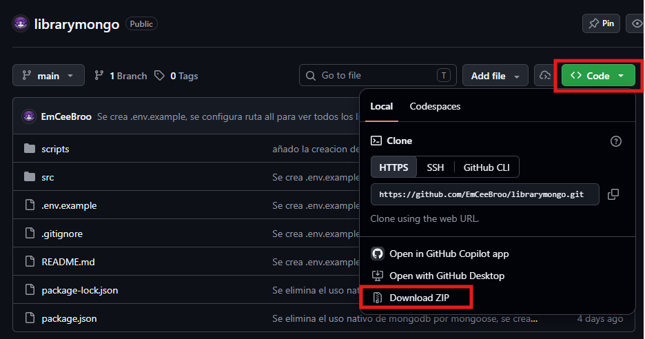

# librarymongo
Mini proyecto de APIREST con bases de datos NoSQL con MongoDB

# Pasos para la clonacion y ejecucion de manera local

1.  - Clonar repositorio
    https://github.com/EmCeeBroo/librarymongo.git 
    
    - Descargar Zip
    Se dirige al boton <> Code, das clic y se podra descargar el archivo en formato ZIP
    

2. Ingresar al directorio del proyecto
   cd nombre-proyecto

3. Instalar dependencias
   npm install

4. Configurar variables de entorno
   Crea el archivo .env basandose en el archivo .env.example

5. Verificar conexion a la base de datos
   node src/server.js

6. Iniciar el servidor en modo desarrollo
   npm run dev

## Autor
- Alejandro Rudas (EmCeeBroo - EmCeeCode)
